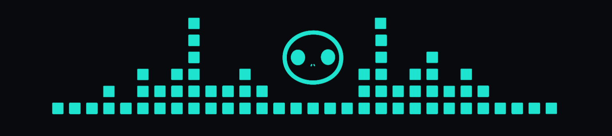

# [Resonate HQ Inc](https://resonatehq.io/)

The driving force behind Resonate.

`durable execution`, `distributed async await`, `cloud programming model`, `dead simple apis`

_Resonate is by developers, for developers._

**Leave retries, crash recovery, idempotency guarantees, service discovery, load balancing, suspension, etc.. to Resonate.**

_Focus on your product._

**Resonate APIs are the quality-of-life improvement developers have been yearning for.**

## Directory

The _resonatehq_ Github org is home to Resonate's open-source component related repos. Such as:

- [Resonate Server](https://github.com/resonatehq/resonate)
- [Resonate Python SDK](https://github.com/resonatehq/resonate-sdk-py)
- [Resonate TypeScript SDK](https://github.com/resonatehq/resonate-sdk-ts)
- [Resonate TypeScript GCP FaaS Shim](https://github.com/resonatehq/resonate-faas-gcp-ts)
- [Resonate TypeScript Cloudflare FaaS Shim](https://github.com/resonatehq/resonate-faas-cloudflare-ts)
- [Resonate TypeScript Kafka Transport Plugin](https://github.com/resonatehq/resonate-transport-kafka-ts)
- [Resonate Docs](https://github.com/resonatehq/docs.resonatehq.io)
- [Distributed Async Await Specification](https://github.com/resonatehq/distributed-async-await.io/)
- etc...

If you are looking for Resonate example applications (example apps showcasing _how to use_ Resonate), visit the [_resonatehq-examples_ Github org](https://github.com/resonatehq-examples).

### Community

Who is into Resonate?

The best thing to do is join the Resonate Community [Discord](https://resonatehq.io/discord). That is where you will find folks who are deeply interested in distributed systems engineering and who are actively using Resonate.

But you can also follow or subscribe on these platforms:

- [Substack](https://journal.resonatehq.io/)
- [Twitter](https://twitter.com/resonatehqio)
- [LinkedIn](https://www.linkedin.com/company/resonatehqio/)
- [YouTube](https://www.youtube.com/@resonatehqio)

### Resonate quickstart

Resonate has a "zero-dependency" development experience.
Apart from installing the Resonate SDk into your project, you don't need to worry about any additional components to get started.

For example, in Python:

```shell
uv add resonate-sdk
```

Or TypeScript:

```shell
bun add @resonatehq/sdk
```

Then initialize Resonate, and start building:

For example, in Python

```py
from resonate import Resonate

resonate = Resonate()

@resonate.register
def foo(ctx, arg):
    # ...
    return result
```

Or TypeScript:

```ts
import { Resonate } from "@resonatehq/sdk";
import type { Context } from "@resonatehq/sdk";

const resonate = new Resonate();

resonate.register("foo", (ctx: Context, arg: string) => {
  // Your function logic here
  return result;
});
```

Check out the docs for more ways to get started: **[Get started with Resonate](https://docs.resonatehq.io/get-started)**

## Foundational principles

Resonate HQ makes software for other developers to use to build reliable and scalable systems.

The quality of our software is highly tied to:

- our obsession with a "simple" developer experience
- our use of specifications, protocols, formal modeling, and formal verification
- our pioneering efforts into Deterministic Simulation Testing
