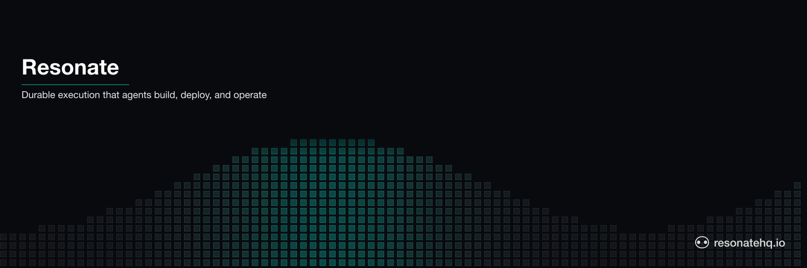
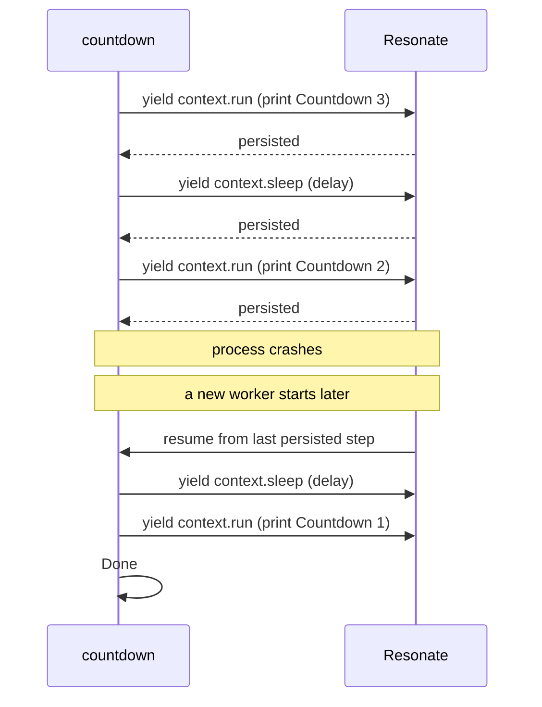

<picture>
  <source media="(prefers-color-scheme: dark)" srcset="./assets/readme-banner-dark.png">
  <source media="(prefers-color-scheme: light)" srcset="./assets/readme-banner-light.png">
  
</picture>

# Resonate

**Your code dies when the process dies. Resonate makes that not happen.** You write normal functions; Resonate persists each step so they survive crashes, restarts, and long waits — minutes, hours, or weeks.

That's *durable execution*: the function's progress is the source of truth. If the worker crashes mid-function, the next worker resumes at the last persisted step. No state-machine DSL, no orchestration glue. Because it's ordinary code, it works the same whether a human wrote it or an agent did — the SDKs, server, and protocol are shaped for both.

This org is the core platform — the SDKs, the server, the protocol spec, and the agent-facing skill files (tool definitions for Claude Code and similar). Runnable examples live next door at [github.com/resonatehq-examples](https://github.com/resonatehq-examples).

```bash
brew install resonatehq/tap/resonate    # the server
npm  install @resonatehq/sdk            # or: pip install resonate-sdk · cargo add resonate-sdk
```

[Documentation](https://docs.resonatehq.io) · [Distributed async/await](https://distributed-async-await.io)

## What it looks like

A durable countdown — each `yield*` is a persisted checkpoint. If the worker crashes at `Countdown: 2`, the next worker resumes at `Countdown: 1`, not back at `Countdown: 3`.

```typescript
// from example-quickstart-ts/countdown.ts
// https://github.com/resonatehq-examples/example-quickstart-ts/blob/6fa52e2/countdown.ts
import { Resonate, type Context } from "@resonatehq/sdk";

function* countdown(context: Context, count: number, delay: number) {
  for (let i = count; i > 0; i--) {
    // Run a function, persist its result
    yield* context.run((context: Context) => console.log(`Countdown: ${i}`));
    // Sleep
    yield* context.sleep(delay * 1000);
  }
  console.log("Done!");
}
// Instantiate Resonate
const resonate = new Resonate({ url: "http://localhost:8001" });
// Register the function
resonate.register(countdown);
```

What happens when the worker crashes mid-countdown:



The sleep is durable, too. The generator's position *is* the state.

## Start here

New to Resonate? Start with the docs, then pick a language.

- [Documentation](https://docs.resonatehq.io) — install, quickstart, concepts
- [TypeScript SDK](https://github.com/resonatehq/resonate-sdk-ts) · [Python SDK](https://github.com/resonatehq/resonate-sdk-py) · [Rust SDK](https://github.com/resonatehq/resonate-sdk-rs)
- [Learn by example](https://github.com/resonatehq-examples) — ~75 runnable patterns in the examples org

## Featured

### SDKs

- [resonate-sdk-ts](https://github.com/resonatehq/resonate-sdk-ts) — TypeScript, on npm as `@resonatehq/sdk`
- [resonate-sdk-py](https://github.com/resonatehq/resonate-sdk-py) — Python, on PyPI as `resonate-sdk`
- [resonate-sdk-rs](https://github.com/resonatehq/resonate-sdk-rs) — Rust, on crates.io as `resonate-sdk`

### Server

- [resonate](https://github.com/resonatehq/resonate) — the durable-promise server, in Rust. `brew install resonatehq/tap/resonate` to install.

### Specification

- [distributed-async-await.io](https://github.com/resonatehq/distributed-async-await.io) — the programming model Resonate implements, served at [distributed-async-await.io](https://distributed-async-await.io)

### Docs & skills

- [docs.resonatehq.io](https://github.com/resonatehq/docs.resonatehq.io) — source for the documentation site
- [resonate-skills](https://github.com/resonatehq/resonate-skills) — skill files (tool definitions) for Claude Code and similar agents

## Browse all

The rest of the catalog.

<details>
<summary><strong>Plugins &amp; adapters</strong></summary>

- **FaaS:** [aws](https://github.com/resonatehq/resonate-faas-aws-ts) · [cloudflare](https://github.com/resonatehq/resonate-faas-cloudflare-ts) · [gcp](https://github.com/resonatehq/resonate-faas-gcp-ts) · [supabase](https://github.com/resonatehq/resonate-faas-supabase-ts)
- **Transport:** [kafka](https://github.com/resonatehq/resonate-transport-kafka-ts) · [webserver](https://github.com/resonatehq/resonate-transport-webserver-ts)
- **Observability:** [opentelemetry](https://github.com/resonatehq/resonate-opentelemetry-ts) · [telemetry](https://github.com/resonatehq/resonate-telemetry) · [observability web ui](https://github.com/resonatehq/resonate-observability-web-ui)

</details>

<details>
<summary><strong>Additional specifications</strong></summary>

- [async-rpc.io](https://github.com/resonatehq/async-rpc.io) — Async RPC spec, served at [async-rpc.io](https://async-rpc.io)
- [durable-promise-specification](https://github.com/resonatehq/durable-promise-specification) — the lower-level durable-promise primitive that the SDKs and server agree on
- [async-await-literature](https://github.com/resonatehq/async-await-literature) — curated papers informing the design

</details>

<details>
<summary><strong>Distribution &amp; tooling</strong></summary>

- [homebrew-tap](https://github.com/resonatehq/homebrew-tap) — `brew install resonatehq/tap/resonate`
- [templates](https://github.com/resonatehq/templates) — scaffolding templates for the Resonate CLI
- [design](https://github.com/resonatehq/design) — brand assets and visual guidelines
- [durable-promise-test-harness](https://github.com/resonatehq/durable-promise-test-harness) — conformance harness for the durable-promise spec
- [resonate-client-ts](https://github.com/resonatehq/resonate-client-ts) — TypeScript client for async RPC from the browser
- [gocoro](https://github.com/resonatehq/gocoro) — Go coroutine library used by the legacy server

</details>

<details>
<summary><strong>Legacy</strong></summary>

- [resonate-legacy-server](https://github.com/resonatehq/resonate-legacy-server) — the Go server, maintenance-only; superseded by [resonate](https://github.com/resonatehq/resonate)

</details>

## Momentum

- **3 published specifications** — [Distributed Async Await](https://distributed-async-await.io) (served), [Async RPC](https://github.com/resonatehq/async-rpc.io), [Durable Promise](https://github.com/resonatehq/durable-promise-specification)
- **3 SDKs speaking the same protocol** — TypeScript, Python, Rust
- **23 Journal posts** at [journal.resonatehq.io](https://journal.resonatehq.io) — patterns, walkthroughs, design rationale

## Community

- Discord: https://resonatehq.io/discord
- X: https://x.com/resonatehqio
- LinkedIn: https://linkedin.com/company/resonatehq
- YouTube: https://youtube.com/@resonatehq
- Journal: https://journal.resonatehq.io

## License

Every Resonate repository is licensed under [Apache-2.0](./LICENSE). Each repo carries its own `LICENSE` file; this one covers the org-profile content.

## Contributing

SDK and server contributions go on the repo where the change lands — `resonate-sdk-ts` / `-py` / `-rs` for SDK work, `resonate` for the server. See [CONTRIBUTING.md](https://github.com/resonatehq/.github/blob/main/CONTRIBUTING.md) for how to contribute code, file bugs, or propose an RFC. To report a bug or propose a change at the org level, open an issue using the templates at [`.github` issues](https://github.com/resonatehq/.github/issues/new/choose). Security issues: see [SECURITY.md](https://github.com/resonatehq/.github/blob/main/SECURITY.md).
